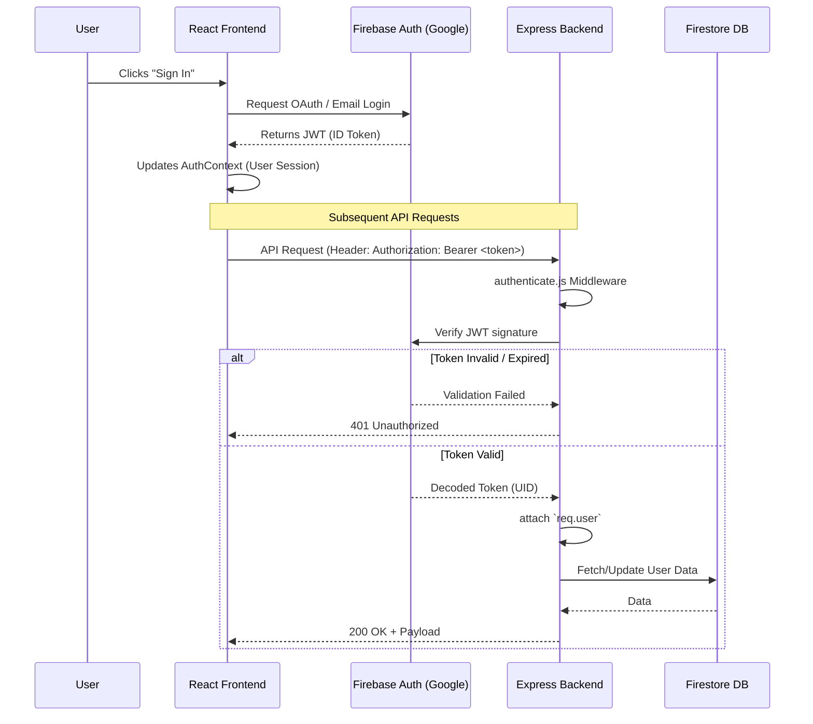
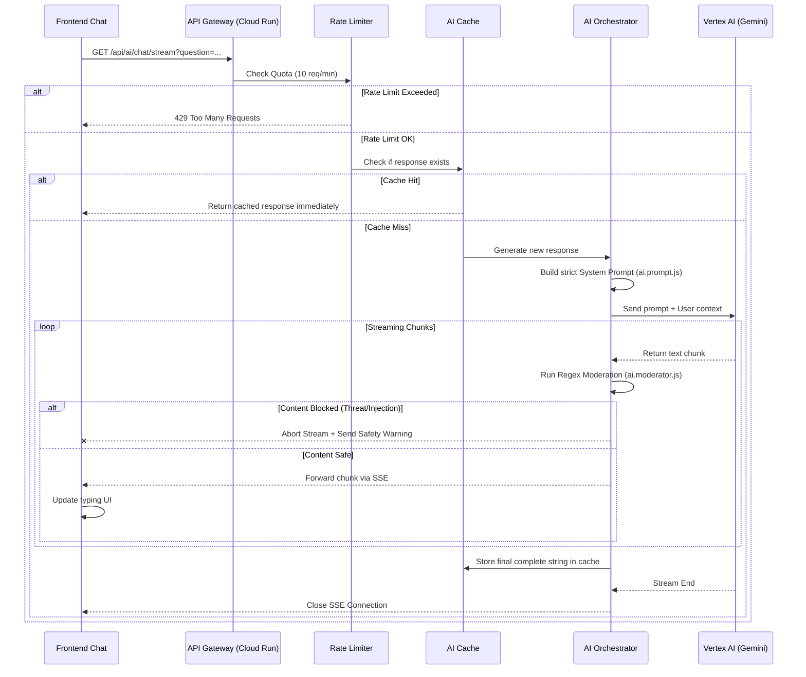
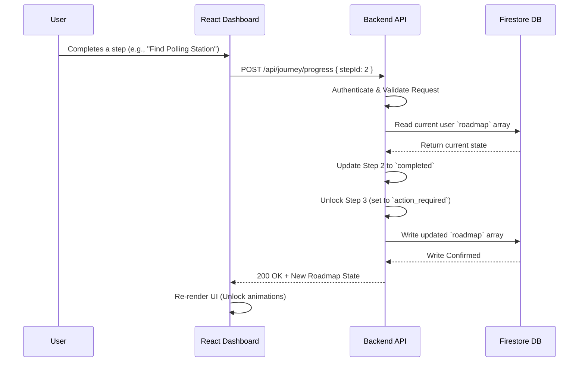
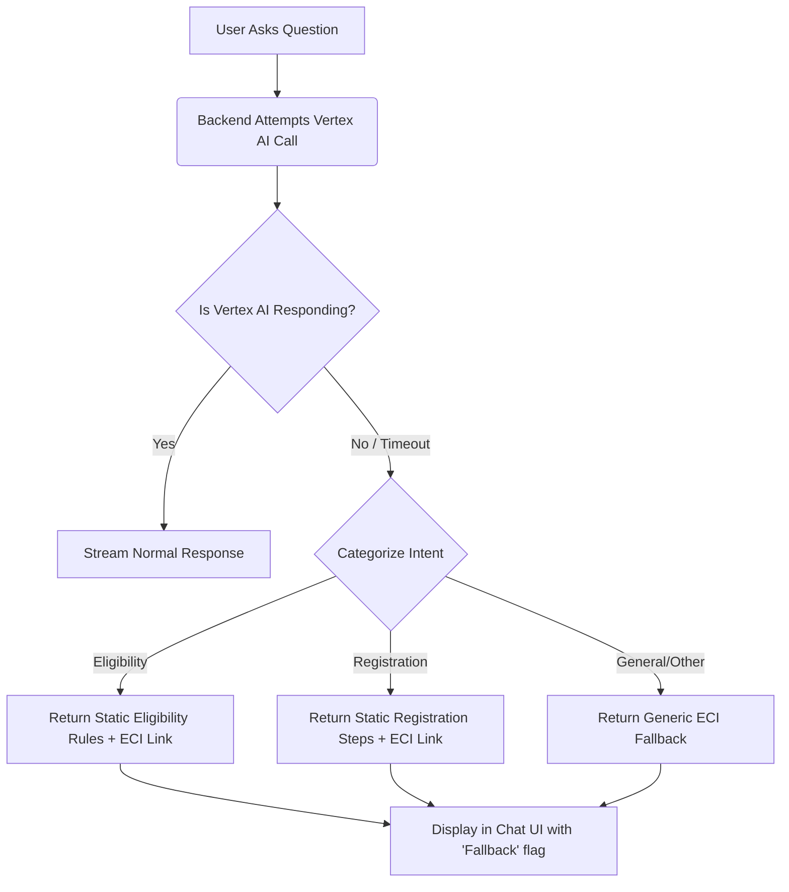

# VoteWise AI System Flow

This document visualizes the core data and control flows within the VoteWise AI platform, detailing how the React Frontend, Node.js Backend, and Google Cloud services interact.

---

## 1. Authentication & API Access Flow

This flow describes how a user signs in and how the backend secures subsequent API requests.

---

## 2. AI Chat Streaming Flow (The Core Engine)

This flow illustrates the journey of a user's question, passing through safety checks, caching, and streaming back via Server-Sent Events (SSE).

---

## 3. User Journey Tracking Flow

This flow tracks how a user progresses through their personalized voter registration roadmap.

---

## 4. Fallback & Graceful Degradation Flow

If the primary AI service (Vertex AI) goes offline or times out, the system degrades gracefully without breaking the user experience.

